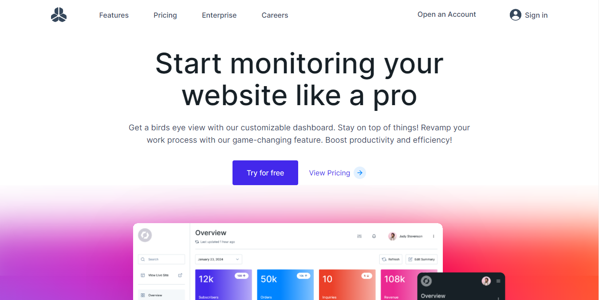

<div align="center">
  
[](https://twitter.com/intent/follow?screen_name=iamt_toby)
  <br />
  <br />

  <h2 align="center">BizTrack - Sales, Support, and Growth Tracking Webapp landing page UI/UX </h2>

BizTrack is a fully responsive Sales, Support, and Growth Tracking Webapp landing page , <br />Responsive for all devices, built using Nextjs, Tailwindcss, and Typescript.

<a href="https://biz-track.vercel.app/"><strong>➥ Live Demo</strong></a>

</div>

<br />

### Demo Screeshots



### Prerequisites

Before you begin, ensure you have met the following requirements:

- [Git](https://git-scm.com/downloads "Download Git") must be installed on your operating system.

### Run Locally

To run **BizTrack** locally, run this command on your git bash:

Linux and macOS:

```bash
sudo git clone https://github.com/richdede/BizTrack.git
```

Windows:

```bash
git clone https://github.com/richdede/BizTrack.git
```

### Contact

If you want to contact with me you can reach me at [LinkedIn](https://www.linkedin.com/in/dee-prince-dede-970913217/).
